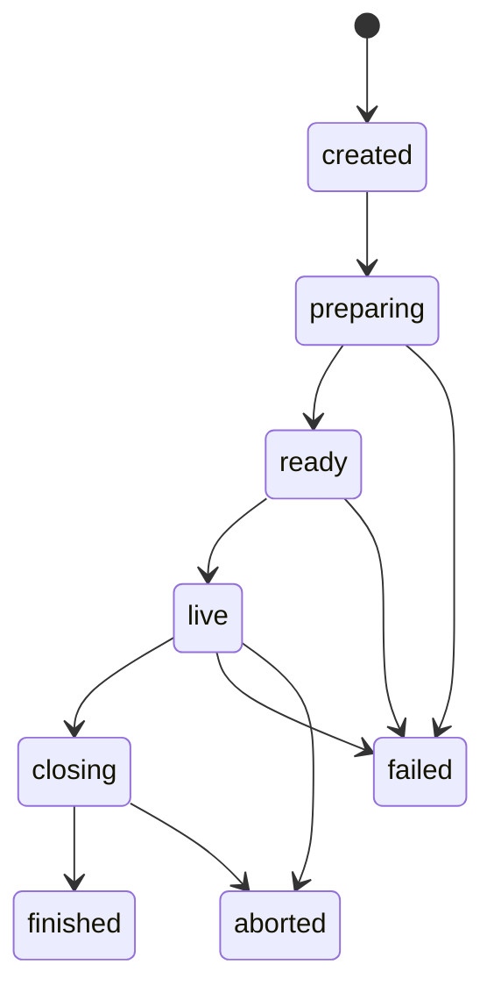

# YouTube Streaming Plugin 設計

> 現在の標準起動では本Pluginを無効化しており、`python -m app`から構成しない。
> ゆらCoreはOBS/YouTube操作や進行表を知らず、YouTubeからはviewer権限の正規化済み
> コメントEventだけを受け取る方針へ移行した。本書の進行機能は旧構成の記録である。

- **Version:** 1.0.0
- **目的:** AIライバーがYouTubeライブ配信を開始し、進行し、視聴者コメントへ反応し、終了できるようにする
- **位置づけ:** `ai_liver_architecture_policy.md`および`plugin_core_contract.md`に従うPlugin固有設計
- **対象:** 配信セッション、進行表、台本、自由発話、コメント処理、開始・終了制御
- **非対象:** OBSの具体操作、TTS、Live2D、YouTube APIの低レベル実装詳細

## 1. Pluginの目的

YouTube Streaming Pluginは、AIライバーによるYouTubeライブ配信を一つの継続Activityとして管理する。

本Pluginは、単にYouTubeコメントを受信するだけではなく、配信開始から終了までの進行を担当する。

主な機能は次のとおり。

- 配信セッションの開始・進行・終了
- 配信予定時間の管理
- オープニングとクロージング
- 台本に沿った発話
- 自由雑談
- コメント受付、選定、応答
- 配信中の質問とOpenPrompt管理
- 残り時間に応じた進行調整
- YouTube接続状態の監視
- 障害時の安全な継続または終了

## 2. Pluginの構成

本Pluginは、配信進行とYouTube固有接続を内部で分離する。

```text
YouTube Streaming Plugin
├─ Streaming Orchestration
│  ├─ StreamSession
│  ├─ RunOfShow
│  ├─ StreamSegment
│  ├─ Script
│  ├─ OpenPrompt
│  └─ StreamProgressionPolicy
│
└─ YouTube Platform Adapter
   ├─ Broadcast Resolver
   ├─ Live Chat Receiver
   ├─ Comment Normalizer
   ├─ Connection Monitor
   └─ YouTube API Client
```

配信進行ロジックはYouTube APIに直接依存させない。

将来、別配信プラットフォームへ対応する場合も、Streaming Orchestrationは再利用できる構造とする。

## 3. 責務

### 3.1 本Pluginの責務

- 配信セッションの状態管理
- 配信進行表の読み込みと実行
- 現在の配信Segmentの管理
- 台本と自由発話の切り替え
- 残り時間の算出
- Segment超過時の調整
- オープニング、メイン、コメント交流、クロージングの進行
- YouTubeライブコメントの受信
- コメントの正規化と重複排除
- コメント候補のCoreへの通知
- OpenPromptの登録と期限管理
- YouTube接続状態の監視
- Plugin固有Resultの生成

### 3.2 本Pluginの非責務

- Character LLMによる最終発話文生成
- どのコメントに返答するかの最終判断
- 発話、字幕、表情、モーションの直接実行
- OBSシーン切り替え
- 実際の音声合成
- Live2Dまたは3Dモデル制御
- Core全体のActivity優先度管理
- 一般的なモデレーションルール
- 長期記憶の保存判断
- YouTube以外の配信プラットフォーム対応

## 4. 提供Capability

本Pluginは、初期化とHealth確認に成功したCapabilityだけを公開する。

```text
stream.session.create
stream.session.start
stream.session.progress
stream.session.close
stream.run_of_show.manage
stream.script.provide
stream.open_prompt.manage
youtube.broadcast.resolve
youtube.live_chat.receive
youtube.live_chat.monitor
```

OBS Pluginが別途有効な場合のみ、Coreは配信開始・終了の外部操作を組み合わせられる。

YouTube Streaming Plugin単体では、OBS操作成功を宣言しない。

## 5. Activity Definition

本Pluginは、少なくとも次のActivity Definitionを提供する。

### 5.1 STREAMING_SESSION

YouTubeライブ配信全体を表す親Activity。

```text
activity_type: streaming_session
supported_operations:
  - create
  - start
  - continue
  - close
  - abort
required_capability:
  - stream.session.create
  - stream.session.start
  - stream.session.progress
  - stream.session.close
ongoing_supported: true
```

### 5.2 STREAM_SEGMENT

配信中の一つの進行区間を表す。

```text
activity_type: stream_segment
supported_operations:
  - start
  - continue
  - complete
  - skip
ongoing_supported: false
```

### 5.3 COMMENT_INTERACTION

コメントを選定し、返答方針を作るActivity。

```text
activity_type: comment_interaction
supported_operations:
  - review
  - respond
  - ignore
  - defer
ongoing_supported: false
```

### 5.4 STREAM_OPEN_PROMPT

配信中に視聴者へ問いかけを提示し、関連コメントを一定期間受け付けるActivity。

```text
activity_type: stream_open_prompt
supported_operations:
  - open
  - extend
  - close
ongoing_supported: true
```

## 6. StreamSession

StreamSessionは、配信開始から終了までの継続状態の正本である。

最低限、次を保持する。

```text
session_id
platform
broadcast_id
title
theme
status
planned_start_at
actual_start_at
planned_end_at
hard_end_at
actual_end_at
current_segment_id
run_of_show_id
remaining_seconds
connection_status
created_at
updated_at
```

### 6.1 Session状態

```text
created
preparing
ready
live
closing
finished
aborted
failed
```

### 6.2 状態遷移



### 6.3 OngoingActivityとの境界

Coreの`OngoingActivity`は、Runtime上の継続Activityとして`STREAMING_SESSION`を保持する。

Plugin内のStreamSessionは、配信固有状態を保持する。

```text
OngoingActivity
    activity_type = streaming_session
    plugin_id = youtube_streaming
    plugin_state_id = session_id

StreamSession
    配信時間、Segment、YouTube接続、進行状態
```

状態を二重管理せず、Coreは`session_id`を参照する。

## 7. RunOfShow

RunOfShowは、配信全体の予定進行を表す。

配信中に書き換えられるRuntime状態とは分離する。

```text
run_of_show_id
title
planned_duration_seconds
hard_end_policy
segments
```

RunOfShowは原則として不変とし、実際の進行差分はStreamSessionおよびSegment Runtime Stateへ記録する。

### 7.1 1時間配信の例

```text
00:00–05:00  opening
05:00–15:00  introduction
15:00–35:00  main_topic
35:00–50:00  free_talk_and_comments
50:00–57:00  final_topic
57:00–60:00  closing
```

この時刻は目標値であり、実行時には残り時間と進行状況に応じて調整できる。

## 8. StreamSegment

StreamSegmentは、RunOfShowを構成する一つの進行区間である。

```text
segment_id
segment_type
title
planned_duration_seconds
minimum_duration_seconds
maximum_duration_seconds
protected
optional
shrink_priority
skip_priority
script_mode
comment_policy
open_prompt_policy
overrun_policy
```

### 8.1 Segment種別

標準種別は次のとおり。

```text
opening
introduction
main_topic
scripted_talk
free_talk
comment_interaction
game
intermission
announcement
closing
```

Plugin固有または他Plugin連携用の追加種別を許可する。

### 8.2 Segment状態

```text
pending
active
overtime
completed
skipped
failed
```

## 9. 配信進行ポリシー

配信進行判断は`StreamProgressionPolicy`として実装し、可能な限り純粋なドメインロジックとする。

入力例:

```text
current_time
session_state
current_segment
segment_runtime_states
remaining_seconds
pending_required_segments
comment_activity
```

出力例:

```text
continue_current
warn_time
complete_current
start_next
shrink_future
skip_optional
start_closing
finish_session
abort_session
```

### 9.1 基本原則

- 配信終了時刻を優先する
- openingとclosingは原則保護する
- 必須告知を保護する
- 自由雑談や任意Segmentから先に短縮する
- 超過分は残りSegmentへ再配分する
- 早く終了した場合は柔軟Segmentへ余剰時間を配分する
- `hard_end_at`を超える前にclosingへ移行する
- 同じSegmentの完了Eventを重複処理しない

### 9.2 超過時の処理

```text
current segment overtime
→ future flexible segmentsを短縮
→ optional segmentsをskip
→ closing開始時刻を確保
→ hard endまでに終了
```

### 9.3 早期終了時の処理

```text
segment completed early
→ free_talkへ追加
→ comment_interactionへ追加
→ next flexible segmentへ追加
```

## 10. Script

Scriptは、配信中に必ず伝える内容と自由表現を分離する。

### 10.1 Script Mode

```text
fixed
key_points
free
```

#### fixed

指定文を原則そのまま使用する。

用途:

- 法的・契約上必要な告知
- 正確性が必要な注意事項
- 定型の開始・終了案内

#### key_points

必須情報だけを保持し、Character LLMが自然な発話へ変換する。

用途:

- オープニング
- 企画説明
- 話題導入
- クロージング

#### free

テーマ、時間、禁止事項だけを与え、Character LLMが自由に発話する。

用途:

- 雑談
- コメント反応
- 話題の橋渡し

### 10.2 Script Item

```text
script_item_id
segment_id
mode
content
required_facts
forbidden_claims
priority
repeat_policy
completion_condition
```

### 10.3 必須情報の扱い

Character LLMは、`required_facts`を無断で削除、改変、追加してはならない。

配信済み情報はScript Item Resultとして記録し、同じ必須告知を不必要に繰り返さない。

## 11. オープニング

オープニングでは、最低限次を扱う。

- 配信開始の挨拶
- キャラクター名
- 配信テーマ
- 当日の予定
- 音声や画面の確認
- 必要な告知
- コメント参加の案内

オープニングの発話内容はCharacter LLMが生成できるが、配信開始成功やOBS操作成功を勝手に宣言してはならない。

外部操作結果はActivity Resultを根拠とする。

## 12. クロージング

クロージングでは、最低限次を扱う。

- 配信内容の短い振り返り
- 視聴とコメントへの感謝
- 必要な告知
- 次回予定が確定している場合のみ案内
- 終了挨拶
- 配信終了操作の準備

クロージング開始後は、緊急性のない新規Segmentを開始しない。

重要コメントへの短い返答は許可できるが、終了時刻を超えない範囲に制限する。

## 13. 自由発話

自由発話は、現在Segment、テーマ、残り時間、直前発話、コメント状況をContextとして生成する。

自由発話の目的は次のいずれかとする。

```text
continue_topic
expand_topic
bridge_topic
react_to_comment
fill_silence
prepare_next_segment
summarize
```

自由発話だけでRunOfShowを変更しない。

進行変更はStreamProgressionPolicyまたは明示Commandを通す。

## 14. コメント受信

YouTube Platform Adapterは、YouTubeライブチャットから取得したコメントを共通形式へ正規化する。

```text
comment_id
broadcast_id
author_id
author_name
message
published_at
received_at
is_owner
is_moderator
is_member
is_super_chat
amount
currency
raw_metadata
```

### 14.1 コメント処理フロー

```text
YouTube API
→ Live Chat Receiver
→ Normalizer
→ Duplicate Filter
→ Basic Moderation
→ Comment Event
→ Core Event Queue
→ Situation Evaluator
→ Behavior Planner
→ COMMENT_INTERACTION
```

YouTube Platform Adapterはコメントへの返答を直接決定しない。

### 14.2 重複排除

`comment_id`を正本として重複を排除する。

再接続やpolling再取得による重複コメントをCoreへ二重投入しない。

### 14.3 コメント保持

全コメントを永続保存することは必須としない。

少なくとも次を区別できるようにする。

```text
received
selected
responded
ignored
deferred
expired
```

## 15. コメント選定

コメントへの返答可否と優先度はCoreのBehavior Plannerが決定する。

Pluginは、選定に必要なメタデータを提供する。

考慮対象例:

- Segmentとの関連性
- 現在話題との関連性
- OpenPromptへの回答か
- 新規性
- コメント時刻
- 同一利用者への連続偏り
- モデレーション結果
- スーパーチャット等の配信上の重要情報
- 残り時間
- 現在の発話状態

基本優先順位の例:

```text
緊急・安全通知
→ 必須配信通知
→ OpenPromptへの有効回答
→ 現在Segmentに強く関連するコメント
→ 重要コメント
→ 通常コメント
→ 低関連・重複コメント
```

全コメントに返答する必要はない。

## 16. OpenPrompt

OpenPromptは、配信中に視聴者へ提示した問いかけを背景状態として管理する。

```text
prompt_id
session_id
segment_id
question_summary
expected_reply_kind
opened_at
expires_at
status
max_responses
selected_response_count
```

### 16.1 状態

```text
open
closed
expired
canceled
```

### 16.2 基本方針

- 質問後も配信進行を停止しない
- 後から届いたコメントを関連付ける
- 関連性の低いコメントを無理に結び付けない
- 期限切れ後は新規回答候補として扱わない
- 一つの質問に対する返答数を制限できる
- closing開始時に不要なOpenPromptを閉じる

## 17. 配信Event

本Pluginが扱う主なEventを次に示す。

```text
stream_session_requested
stream_preparation_started
stream_preparation_completed
stream_ready
stream_started
stream_segment_started
stream_segment_time_warning
stream_segment_overtime
stream_segment_completed
stream_segment_skipped
stream_comment_received
stream_comment_selected
stream_open_prompt_created
stream_open_prompt_expired
stream_closing_requested
stream_finished
stream_aborted
stream_failed
youtube_connection_lost
youtube_connection_restored
```

Event名は具体的なAPIレスポンス名ではなく、ドメイン上の意味を表す。

## 18. Plugin Command

標準Commandは次のとおり。

```text
create_session
prepare_session
start_session
start_segment
complete_segment
skip_segment
open_prompt
close_prompt
select_comment
request_closing
finish_session
abort_session
reconnect_youtube
```

Commandには少なくとも次を含める。

```text
command_id
correlation_id
session_id
operation
constraints
state_version
requested_at
```

StreamSessionの状態を変更するCommandでは`state_version`を検証する。

## 19. Plugin Result

Plugin Resultは、処理事実を構造化して返す。

例:

```text
status
session_id
segment_id
operation
summary
failure_reason
next_expected_event
state_version
```

### 19.1 Result例

```text
start_session:
  status: succeeded
  session_id: ...
  summary: 配信セッションをlive状態へ移行した

start_segment:
  status: succeeded
  segment_id: opening
  summary: opening segmentを開始した

select_comment:
  status: succeeded
  comment_id: ...
  summary: 返答候補として選定した
```

発話、字幕、音声、表情の成功は別のActivity Resultで管理する。

## 20. YouTube接続

YouTube Platform Adapterは次を担当する。

- 対象Broadcastの解決
- Live Chat IDの取得
- コメント受信
- nextPageToken管理
- polling間隔管理
- quotaエラー検知
- 接続切断検知
- 再接続
- コメント重複排除
- YouTube固有レスポンスの正規化

低レベルAPI仕様はAdapter内部に閉じ込める。

CoreやStreaming OrchestrationへYouTube APIレスポンスを直接渡さない。

## 21. 接続障害

### 21.1 コメント受信障害

コメント受信が停止しても、配信進行は継続できる。

```text
youtube_connection_lost
→ comment capabilityをdegradedまたはunavailable
→ 配信進行は継続
→ 再接続を制限回数で試行
→ 復旧時にCapabilityを再登録
```

### 21.2 配信状態取得障害

配信状態が確認できない場合、成功状態を推測しない。

必要に応じて次を行う。

- 状態をunknownにする
- 操作を保留する
- Coreへ失敗Resultを返す
- 利用者へ安全な案内を生成する
- 手動終了を可能にする

### 21.3 API quota

quota不足時は無制限に再試行しない。

コメント受信頻度を下げる、コメント機能を停止する、配信進行だけ継続するなどの縮退動作を許可する。

## 22. OBS Pluginとの連携

OBS操作は別Pluginの責務とする。

YouTube Streaming Pluginは、OBS Pluginを直接呼び出さない。

Coreの共通Activity pipelineとの接続はComposition RootのGatewayが担当する。
Plugin側はShared Contractsの`PluginActivityResult`と`PluginEvent`だけを扱い、
Core内部のActivity ResultやAgent Eventへ直接依存しない。

必要な場合はCoreへActivity RequestまたはFollow-up Eventを返す。

```text
YouTube Streaming Plugin
→ stream_preparation_completed
→ Core Behavior Planner
→ OBS Plugin start request
→ OBS Plugin Result
→ Streaming Session start判断
```

配信開始の成功判定は、必要な外部操作Resultが揃ってから行う。

## 23. TTS・字幕・Avatarとの連携

本Pluginは発話本文、字幕、表情、モーションを直接実行しない。

Plugin Activity Requestとして次をCoreへ返す。

```text
response_facts
speech_goal
script_mode
required_facts
forbidden_claims
expression_hint
motion_hint
```

CoreがCharacter LLM、Response Validator、Action Planner、Action Schedulerを通して実行する。

## 24. Memory Policy

配信情報の保存方針を区別する。

### 保存候補

- 配信タイトル
- 配信テーマ
- Segment実績
- 重要コメントへの応答
- 配信の要約
- 次回へ引き継ぐ課題

### 原則保存しないもの

- 全コメントの長期記憶
- 一時的な接続情報
- APIレスポンス
- コメントpolling状態
- 重複排除用内部データ
- 一時的なOpenPrompt候補

PluginはMemory Policyを返し、Coreが保存処理を行う。

## 25. 設定

想定設定例:

```yaml
plugins:
  youtube_streaming:
    enabled: true

    session:
      default_duration_minutes: 60
      hard_end_grace_seconds: 30

    comments:
      enabled: true
      polling_interval_seconds: 5
      max_pending_comments: 200
      duplicate_ttl_seconds: 3600

    open_prompt:
      default_ttl_seconds: 300
      max_open_prompts: 3
      max_responses_per_prompt: 5

    progression:
      closing_protected_seconds: 180
      time_warning_seconds: 60
```

認証情報はこの設定へ直接記載せず、安全な秘密情報管理から参照する。

## 26. Clock

配信時間管理は直接システム時刻へ依存せず、Clock Portを使用する。

用途:

- 1時間配信の高速シミュレーション
- Segment超過テスト
- hard endテスト
- OpenPrompt期限テスト
- 再接続待機テスト

テストでは時刻を任意に進められるFake Clockを使用する。

## 27. 実装対象

本Pluginの実装対象は、設計上の最終構成として次を含む。

### 27.1 配信進行

- StreamSession
- RunOfShow
- StreamSegment
- Segment Runtime State
- StreamProgressionPolicy
- 配信開始、進行、クロージング、終了
- 超過、短縮、スキップ、余剰時間再配分
- hard end保護
- SessionとSegmentの状態管理

### 27.2 台本と発話

- Script Item
- fixed / key_points / freeの各Script Mode
- required facts
- forbidden claims
- オープニング生成
- クロージング生成
- 自由雑談
- Segment間の橋渡し
- 配信残り時間を考慮した発話制御

### 27.3 コメント処理

- YouTubeライブコメント受信
- コメント正規化
- 重複排除
- 基本モデレーション
- コメント候補管理
- コメント選定用メタデータ
- COMMENT_INTERACTION Activity
- 応答済み、保留、無視、期限切れの状態管理

### 27.4 OpenPrompt

- OpenPromptの登録、延長、終了、期限切れ
- コメントとの関連付け
- 最大返答数
- 複数OpenPromptの管理
- closing時の終了処理

### 27.5 YouTube接続

- Broadcast解決
- Live Chat ID取得
- polling
- nextPageToken管理
- 接続状態監視
- 再接続
- quota不足時の縮退
- コメントCapabilityの登録と解除

### 27.6 Core連携

- Activity Definition
- Capability
- Plugin Command
- PluginExecutionResult
- PluginActivityRequest
- Follow-up Event
- Memory Policy
- OngoingActivity
- Response Context
- correlation IDによる追跡

### 27.7 外部Plugin連携

- OBS Pluginとの配信開始・終了連携
- TTS Pluginとの音声出力連携
- Avatar Pluginとの表情・モーション連携
- Moderation Pluginとのコメント判定連携
- Memory Pluginとの配信要約保存連携

本節は実装順を示すものではない。実装順、移行順、作業単位はCodex向け実装指示で管理する。

## 28. テスト条件

最低限、次をテストする。

### Session

- Sessionを作成できる
- 不正な状態遷移を拒否する
- 二重開始を拒否する
- finished後の再開を拒否する
- abort後に進行しない
- StreamSessionとOngoingActivityの状態が矛盾しない

### RunOfShow

- 通常順序でSegmentが進む
- 任意Segmentをskipできる
- 必須Segmentを保護できる
- openingとclosingを保護できる
- RunOfShowの予定とRuntime状態を分離できる

### 時間調整

- Segment超過で後続Segmentが短縮される
- optional Segmentがskipされる
- 早期完了時間が再配分される
- hard end前にclosingへ移行する
- hard endを超えて新規Segmentを開始しない
- Fake Clockで長時間配信を決定論的に再現できる

### Script

- fixed Scriptの必須文言を維持する
- key_pointsのrequired factsを維持する
- forbidden claimsを含む発話を拒否できる
- 同じ必須告知を不必要に繰り返さない
- Script完了状態を正しく記録できる

### OpenPrompt

- 質問後も進行が継続する
- 関連コメントを紐付けられる
- 期限切れ後は紐付けない
- 最大返答数を超えない
- closing時に閉じられる
- 複数OpenPromptを区別できる

### コメント

- 重複コメントを排除する
- 全コメントへ返答しない
- 重要コメントを優先候補にできる
- 低関連コメントを無視できる
- 再接続後も同じコメントを二重処理しない
- コメント受信障害中も配信進行が停止しない

### YouTube接続

- Broadcastを解決できる
- Live Chat IDを取得できる
- pollingを継続できる
- nextPageTokenを更新できる
- 接続喪失を検知できる
- 再接続成功でCapabilityが復旧する
- quota不足で無制限再試行しない
- 状態不明時に成功を推測しない

### 外部Plugin連携

- OBS開始結果を受けてSessionをliveへ遷移できる
- OBS失敗時にlive開始済みと扱わない
- TTS、字幕、Avatarの失敗をPlugin実行成功と混同しない
- 外部Plugin無効時に適切な拒否Resultを返せる

### 障害

- Plugin障害でCore全体が停止しない
- Capability喪失時にRegistryから解除される
- 再試行回数に上限がある
- 失敗後に同じActivityを無制限再提案しない
- 内部例外を利用者向け発話へ直接露出しない

### 冪等性

- 同じCommandを重複実行しない
- 同じEventを二重適用しない
- Segment完了を二重記録しない
- Session終了を二重実行しない
- 同じコメントへ二重応答しない

## 29. 完成条件

本Pluginの完成条件を次とする。

- YouTubeライブ配信の開始準備から終了までを一つのStreamSessionとして管理できる
- RunOfShowに従ってopening、main、free talk、comment interaction、closingを進行できる
- 台本、要点、自由発話をSegmentごとに切り替えられる
- コメント受信、重複排除、選定、応答が成立する
- OpenPrompt中も配信進行が停止しない
- 超過、短縮、スキップ、余剰時間再配分が成立する
- hard endまでにclosingと終了が成立する
- YouTube接続喪失時も可能な範囲で配信進行を継続できる
- 再接続時にCapabilityを復旧できる
- OBS Plugin、TTS Plugin、Avatar PluginとCore経由で連携できる
- PluginExecutionResultとAction実行結果を分離して追跡できる
- 実行していない処理を成功したように発話しない
- Plugin無効時もCoreが通常動作する
- CoreへYouTube固有分岐を追加しない
- 長時間配信をFake Clockと実接続の両方で検証できる
- 異常終了、手動終了、接続障害、quota不足を安全に処理できる

## 30. 本書で扱わない内容

次は別文書またはAdapter実装で管理する。

- YouTube APIの個別エンドポイント
- OAuth認証手順
- API quotaの具体値
- OBS WebSocketのCommand
- Live2D制御
- VOICEVOX制御
- キャラクター設定
- 実際の配信台本本文
- 特定企画の進行内容
- 個別ゲームの仕様
- 実装順序
- 移行手順
- Codexへ渡す作業単位
