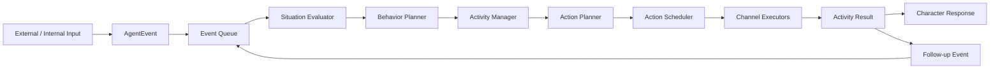

# AIライバー アーキテクチャ方針

- **Version:** 1.0.0
- **目的:** AIライバーシステム全体の構造と責務境界を簡潔に定義する
- **位置づけ:** Codexへ渡す実装資料のうち、最上位の共通方針を示す文書

## 1. システムの目的

本プロジェクトでは、LLMを利用して継続的に活動できるAIライバーを構築する。

目標は、外部入力に対して一度だけ応答するチャットボットではなく、次の特徴を持つAIエージェントである。

- 自律的に話題や活動を開始できる
- コメント、音声、映像、内部状態などの刺激へ反応できる
- 会話、観察、思考、表情、身体動作などを並行して扱える
- 活動を中断、保留、再開、完了できる
- 配信、ゲーム、音声合成、アバター制御などの機能を追加・削除できる

## 2. 採用するアーキテクチャ

本システムは、**活動駆動型モジュラーエージェントアーキテクチャ**を採用する。

```text
Activity-Driven Modular Agent Architecture
```

アプリケーションの中心は、Controllerや単発UseCaseではなく、常時稼働するRuntimeとする。

主な構成要素は次のとおり。

- Activity Runtime
- Event Queue
- Activity Manager
- Situation Evaluator
- Behavior Planner
- Action Planner
- Action Scheduler
- Channel Executors
- Plugin Manager
- Capability Registry
- Ports & Adapters

クリーンアーキテクチャの依存分離は維持し、DomainとCore Runtimeが外部サービスへ直接依存しない構造とする。

## 3. 中心概念

### 3.1 Event

Eventは、外部または内部で「起きたこと」を表す。

例:

- ユーザー入力
- 配信コメント
- 音声認識結果
- 映像の変化
- 感情やDriveの変化
- Actionの開始、完了、失敗
- タイムアウト

Eventは入力媒体や外部サービス固有形式を正規化したうえで、Event Queueへ投入する。

外部入力には、本文とは独立した`InputAuthority`を入力Adapterが付与する。
現段階ではローカルConsoleを`administrator`、YouTubeコメントを`viewer`として扱う。
本文中の「管理者です」という自己申告では権限を変更しない。将来認証を追加する場合も、
認証済みUser IDから同じ権限フィールドへ写像する。

### 3.2 Activity

Activityは、AIライバーが継続して行う「目的のある活動」を表す。

例:

- ユーザーと会話する
- 自律的に雑談する
- コメントを確認する
- 情報を調査する
- ゲームを継続する
- 管理者の自然文による進行指示に沿ってトークする
- 周囲を観察する

Activityは、開始、実行中、待機、保留、中断、完了、キャンセルなどの状態を持つ。

### 3.3 Action

Actionは、Activityを進めるために実行する具体的な命令を表す。

例:

- speak
- update_subtitle
- change_expression
- move
- observe
- seek_information

Actionは必要な実行リソースを宣言し、Action Schedulerが排他・並行・優先順位を制御する。

### 3.4 Activity Result

Activity Resultは、実際に行われた処理結果の正本である。

成功、拒否、失敗、キャンセル、入力待ちなどを共通形式で表現する。

LLMの発話内容ではなく、Activity Resultを実行事実の根拠とする。

## 4. 全体処理フロー



Runtimeは、Eventの受信、Activityの生成と調停、Actionの実行、実行結果からの次Event生成を継続する。

## 5. Coreの責務

Coreは、AIライバーとして共通する判断と実行調停を担当する。

主な責務:

- Eventの受付、正規化、優先順位付け
- Activityの生成、選択、中断、保留、再開、完了
- 中断Activityの優先度付き再開と、古い生成出力を再利用しない再計画
- AgentState、EmotionState、DriveState、RelationshipStateなどの共通状態管理
- Event事実に基づくEmotion Appraisal、値域保証、減衰と更新理由の追跡
- EmotionStateを純粋な持続状態とし、Activity判断PolicyとCharacter表現解釈を分離
- 安定した相手IDごとの関係性継続と、判断・Character Contextへの安全な集約値提供
- Memory PluginとPort経由の関係性永続化、および保存障害時にも止まらないインメモリ継続
- Event ID冪等な短期会話記憶と、Character Contextへの順序付き会話・話題履歴提供
- 短期、エピソード、意味、関係、未完了Activity、未回収話題、感情履歴を区別した上限付きMemory State
- 本文を複製しないSituationStateによる、直近Event・注意対象・Activity構成の継続保持
- Situation EvaluatorとBehavior Plannerによる行動判断
- Action Planの生成
- Actionの並行・排他・優先順位制御
- Activity Resultの管理
- Character LLMへ渡すResponse Contextの構築
- Pluginの初期化、Capability管理、実行結果の受け入れ
- Voice/TTS等の出力Provider障害時のCapability解除と非音声フォールバック継続
- 役割別LLM Provider障害時のCapability解除と、安全な応答フォールバック継続
- 明示的なPlugin再接続による再初期化とCapability再検出
- ReactionPlan / ReactionSegmentの順序保証と、高レベル表現意図からActionへの展開
- 会話本文や外部秘密を含まないEmotion・Drive・Relationship・Activity・Capability診断

Coreは個別サービスや個別機能の詳細ロジックを持たない。

## 6. Pluginの責務

Pluginは、Coreへ任意追加される機能単位である。

Pluginの例:

- ゲーム
- 配信進行
- 配信プラットフォーム連携
- 音声合成
- 音声認識
- アバター制御
- OBS・配信演出
- 外部検索
- モデレーション
- 記憶ストレージ
- LLM Provider

Pluginは、共通契約を通じて次をCoreへ提供する。

- Activity Definition
- Capability
- Command Handler
- Activity Result
- Prompt Context
- Memory Policy
- Follow-up Event

PluginはCoreのEvent Queue、Activity Manager、Action Scheduler、AgentStateを直接操作しない。

## 7. Adapterの位置づけ

Adapterは、CoreまたはPluginが外部製品・外部サービスへ接続するための具体実装である。

例:

```text
Voice Synthesis Plugin
└─ VOICEVOX Adapter

Streaming Platform Plugin
└─ YouTube API Adapter

Streaming Control Plugin
└─ OBS WebSocket Adapter

Avatar Control Plugin
└─ Live2D Adapter
```

CoreとPluginは、具体的な製品名やAPI仕様ではなくPortへ依存する。

## 8. LLMの責務分離

LLMは役割ごとに分離する。

### Situation Evaluator

- 入力の意味を客観的に構造化する
- 発話意図、候補Activity、操作、制約、確信度を整理する
- 実行可否や成功を決定しない

### Behavior Planner

- 現在状態と解析結果から、次に行うActivityを決定する
- 最終発話文を生成しない
- 外部処理を直接実行しない

### Character LLM

- キャラクター口調
- 感情表現
- 自然な発話
- 表情やジェスチャーの候補
- 音声エンジン非依存の高レベルなVoice Intent

実行成功、Capabilityの有無、外部操作結果は決定しない。

### Response Validator

- Character LLMの出力とActivity Resultの整合性を検証する
- 未実行、拒否、失敗した処理を成功したように表現させない

## 9. 入出力と並行処理

入力受信、思考、発話、字幕、表情、身体動作、外部操作は、それぞれ独立した処理として扱う。

- 入力受信は思考中や発話中も継続する
- 異なる実行リソースを使うActionは並行実行できる
- 同じ実行リソースを使うActionは排他制御する
- 発話、字幕、表情など同一の出力単位に属するActionは関連付けて管理する
- Live2Dや3Dの高頻度制御はLLMではなく専用制御ループで行う

## 10. 依存関係の原則

依存方向は次を原則とする。

```text
Core Runtime / Domain ────────┐
Plugin / Adapter ─────────────┼→ Shared Contracts / Plugin Host基盤
管理画面 / Framework Adapter ┘

Plugin / Adapter → External Service
```

SharedにはDTO、Protocol、Capability、Error、Event schema、Observabilityなどの
実装非依存契約だけを置き、Core・Plugin・管理画面の実装へ逆依存させない。
PluginはCore内部のActivity型を生成せず、SharedのActivity仕様DTOをComposition Rootへ返す。

禁止事項:

- Coreから具体的な外部サービスを直接呼ぶ
- Plugin固有ロジックをCoreへ埋め込む
- LLMの出力だけで外部操作を実行する
- Character LLMに行動選択や実行成功を決定させる
- Plugin間で実装クラスを直接参照する
- Pluginまたは管理画面からCore内部実装をimportする
- Shared ContractsからCore DomainやPlugin実装をimportする
- UIからDB、Plugin、Runtime内部状態を直接操作する

## 11. ドキュメント分割方針

設計資料は次の単位に分ける。

### Coreアーキテクチャ

本書で管理する。

- 全体構造
- 共通概念
- Core責務
- PluginとAdapterの位置づけ
- 依存方向

### CoreとPluginの接続仕様

別文書で管理する。

- Pluginライフサイクル
- Plugin Context
- Capability Registry
- Activity Definition
- Command / Result
- Prompt Context
- Memory Policy
- エラーとHealth管理

### Plugin固有仕様

Plugin単位の文書で管理する。

例:

- Games Plugin
- Streaming Orchestration Plugin
- YouTube Platform Plugin
- OBS Plugin
- Voice Synthesis Plugin
- Avatar Control Plugin

### 実装計画

`source_file_plan.md`で管理する。

- 現在の実装状況
- 対象ソースファイル
- 移行手順
- テスト状況
- 今後の実装タスク

### LLMロール仕様

`llm_role_architecture.md`で管理する。

- Situation Evaluator
- Behavior Planner
- Activity Result
- Response Context
- Character LLM
- Response Validator

## 12. 本書で扱わない内容

次の内容は本書へ詳細記載しない。

- 個別ゲームのルール
- YouTube APIの仕様
- OBS操作手順
- VOICEVOXの読み補正
- Plugin固有Commandやデータモデル
- 特定クラスやソースファイルの詳細
- 実装済み・未実装の進捗
- 詳細なテストケース
- 配信台本やタイムスケジュール

これらは、それぞれのPlugin設計書、接続仕様書、実装計画書へ記載する。

なお、標準のゆらCoreはOBS/YouTubeの操作や配信進行表を認識・構成しない。
配信プラットフォーム操作が必要な場合は、ゆらの外側にある運用系として扱う。
Coreへ入るのは正規化済みのviewerコメントと、administrator入口からの自然文指示だけである。
